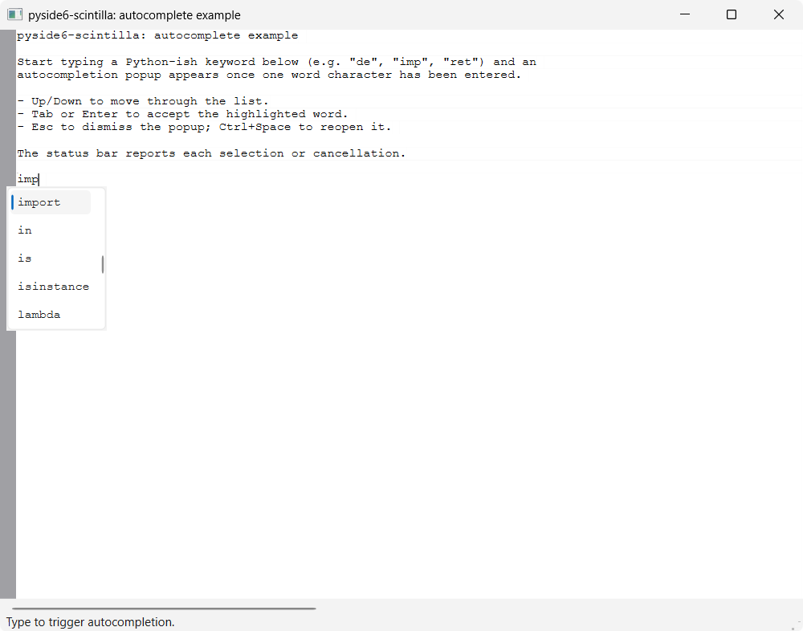

# Autocomplete

A minimal `QMainWindow` with a `ScintillaEdit` central widget demonstrating
word autocompletion from a static keyword list — the pyside6-scintilla
equivalent of QScintilla's `QsciAPIs` + `setAutoCompletion*` convenience
layer, done by calling Scintilla's autocompletion messages directly:

- watches the `charAdded` signal to (re)open the popup as a word is typed
- computes the word fragment under the caret with `wordStartPosition()` and
  shows the list via `autoCShow()`; Scintilla filters and inserts the choice
- configures case-insensitive matching (`autoCSetIgnoreCase`) and a
  1-character threshold, mirroring QScintilla's autocompletion settings
- binds <kbd>Ctrl</kbd>+<kbd>Space</kbd> to explicitly reopen the popup
  (after <kbd>Esc</kbd>, or to complete a word mid-way)
- reacts to the `autoCompleteSelection` / `autoCompleteCancelled` signals,
  reporting each outcome in the status bar

## Completion words

The words offered for completion are the static `KEYWORDS` list defined near
the top of the example's `main.py` — a small, illustrative set of Python-ish
keywords and builtins. Edit that list to change what the popup suggests. In a
real editor these might instead come from a lexer's keyword sets, the symbols
in the open document, or a language server; this example keeps them hard-coded
so it stays self-contained (no lexer dependency).

## Running

From the repo root, after `uv sync`:

```bash
uv run python examples/autocomplete/main.py
```

Type a keyword fragment (e.g. `de`, `imp`, `ret`), then <kbd>Tab</kbd> or
<kbd>Enter</kbd> to accept the highlighted word, or <kbd>Esc</kbd> to dismiss
the popup.

## Source

[`examples/autocomplete/`](https://github.com/borco/pyside6-scintilla/tree/master/examples/autocomplete)

## Screenshots


