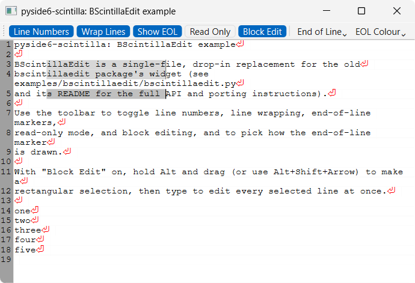

# BScintillaEdit drop-in replacement

A small, portable, single-file `BScintillaEdit(QScrollArea)` widget that's a
**drop-in replacement** for the old, now-archived `bscintillaedit` PyPI
package's widget of the same name (see
[Project mission](../mission.md)). Copy `bscintillaedit.py` straight into
your own project — same base class, properties, signals, and slots
(`lineEndVisible`, `lineNumbersVisible`, `lineWrapped`, `readOnly`, `text`,
their `*Changed` signals and setter slots, and `clear()`), same defaults (LF
line endings, hidden symbol margin, styled line-number margin, "↩"
end-of-line glyph) as the old widget — only the import line changes.
`blockEditEnabled` is new, additive functionality not in the old widget.

The demo `main.py` shows `BScintillaEdit` used as a `QMainWindow`'s central
widget, with toolbar toggles for each property and menus for picking the
end-of-line representation glyph and colour. See
[`examples/bscintillaedit/README.md`](https://github.com/borco/pyside6-scintilla/tree/master/examples/bscintillaedit)
for the full API reference, porting steps, and efficient editor-sync
patterns.

## Running

From the repo root, after `uv sync`:

```bash
uv run python examples/bscintillaedit/main.py
```

## Source

[`examples/bscintillaedit/`](https://github.com/borco/pyside6-scintilla/tree/master/examples/bscintillaedit)

## Screenshots


