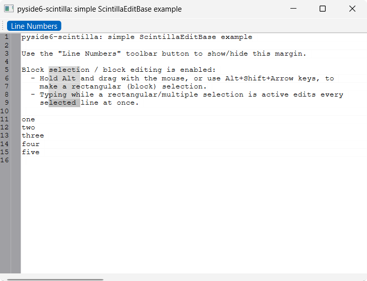

# Simple ScintillaEditBase edit

A minimal `QMainWindow` with a `ScintillaEditBase` central widget,
demonstrating:

- a toolbar button that shows/hides the line-number margin
- block (rectangular) selection — hold <kbd>Alt</kbd> and drag, or use
  <kbd>Alt</kbd>+<kbd>Shift</kbd>+arrow keys
- block (multi-line) editing — typing while a rectangular/multiple
  selection is active edits every selected line at once



## Running

From the repo root, after `uv sync`:

```bash
uv run python examples/simple_scintilla_base_edit/main.py
```

## Source

[`examples/simple_scintilla_base_edit/`](https://github.com/borco/pyside6-scintilla/tree/master/examples/simple_scintilla_base_edit)
