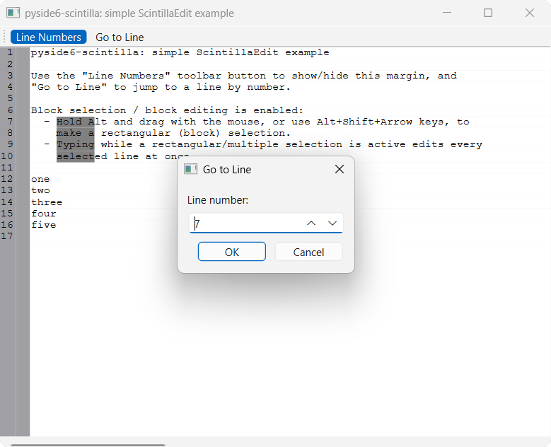

# Simple ScintillaEdit edit

A minimal `QMainWindow` with a `ScintillaEdit` central widget, demonstrating:

- a toolbar button that shows/hides the line-number margin
- a "Go to Line" toolbar action
- block (rectangular) selection — hold <kbd>Alt</kbd> and drag, or use
  <kbd>Alt</kbd>+<kbd>Shift</kbd>+arrow keys
- block (multi-line) editing — typing while a rectangular/multiple
  selection is active edits every selected line at once

Contrasts with [Simple ScintillaEditBase
edit](simple_scintilla_base_edit.md), which uses `ScintillaEditBase`'s raw
`send`/`sends` message API: this example uses `ScintillaEdit`'s typed,
per-message methods (e.g. `setText()`, `lineCount()`, `gotoLine()`) instead.

## Running

From the repo root, after `uv sync`:

```bash
uv run python examples/simple_scintilla_edit/main.py
```

## Source

[`examples/simple_scintilla_edit/`](https://github.com/borco/pyside6-scintilla/tree/master/examples/simple_scintilla_edit)

## Screenshots


