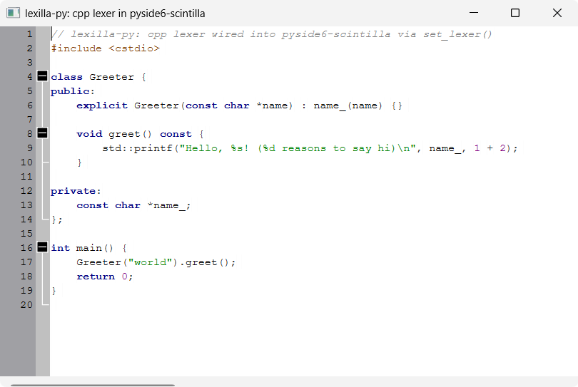

# Lexilla syntax highlighting and folding

A minimal `QMainWindow` with a `ScintillaEdit` central widget, showing real
C++ syntax highlighting driven by a
[lexilla](https://github.com/borco/lexilla-py)-created `"cpp"` lexer — the
cross-binding pointer path described in lexilla-py's
[docs/specs/mission.md](https://github.com/borco/lexilla-py/blob/master/docs/specs/mission.md#cross-binding-integration-raw-pointer-with-an-optional-convenience-extra)
"Cross-binding integration" decision:

```python
from lexilla import Language, create_lexer
from lexilla.pyside6_scintilla import set_lexer

lexer = create_lexer(Language.CPP)
set_lexer(editor, lexer)
```

`set_lexer()` hands the lexer's `ILexer5*` to Scintilla via `SCI_SETILEXER`
(`setILexer()`) and takes ownership from there — the `Lexer` wrapper must not
be used again afterwards. Once wired up, Scintilla calls the lexer's
`Lex()`/`Fold()` itself whenever it needs to (re)style text, so — unlike
the `pygments_highlighting`/`tree_sitter_highlighting` examples below, which
re-tokenize on every edit because `pyside6-scintilla` has no lexer of its
own — no per-edit glue code is needed here.

This example still sets the *colors* per style number itself
(`styleSetFore()`), and the keyword word list (`setKeyWords()`) — the lexer
only assigns style numbers (`SCE_C_*`, from Lexilla's own `SciLexer.h`) to
ranges of text, the same way SciTE's properties files do for any other
Scintilla-based editor.

## Resolving style numbers by name, not hardcoding them

`SCE_C_*` numbers are baked into the compiled `cpp` lexer itself
(`LexCPP.cxx`'s own style table), not chosen by lexilla-py — and with 125
vendored lexers, each with its own style set, lexilla-py doesn't generate a
static enum per lexer for them (same staleness risk as any generated enum,
multiplied by 125). Instead it binds `ILexer4`'s real runtime introspection
([borco/lexilla-py#8](https://github.com/borco/lexilla-py/issues/8)), so
`main.py` keys its `STYLES_BY_NAME` dict by the lexer's own symbolic names
(`"SCE_C_DEFAULT"`, `"SCE_C_WORD"`, ...) and resolves them to that lexer
instance's actual style numbers at runtime:

```python
style_by_name = {lexer.name_of_style(s): s for s in range(lexer.named_styles())}
```

This doesn't make the names themselves discoverable out of nowhere — you
still need to know what a `cpp` lexer can style before writing
`STYLES_BY_NAME`, the same way you'd have needed to know the numbers before.
What changes is *which* part of that knowledge you commit to source: names
are part of Lexilla's stable, documented surface (`SciLexer.h`'s macro
names, mirrored 1:1 by `name_of_style()`); the numbers are an implementation
detail that can shift between Lexilla versions or with sub-style
allocation. To see the full list of names/descriptions a lexer exposes —
either to write a `STYLES_BY_NAME` for a different language, or just to
explore — run:

```python
from lexilla import Language, create_lexer

lexer = create_lexer(Language.CPP)
for s in range(lexer.named_styles()):
    print(s, lexer.name_of_style(s), lexer.description_of_style(s))
```

`main.py` also asserts `STYLES_BY_NAME`'s keys against this same lookup at
startup, so a typo'd style name fails loudly there instead of as a
confusing `KeyError` deep in the styling loop.

## Margins

Scintilla starts with 5 margins, plain slots numbered `0..Scintilla.MaxMargin`
(4) — `setMargins(n)` can allocate more or fewer. A margin index by itself
means nothing; `setMarginTypeN()`/`setMarginWidthN()`/etc. are what actually
give a slot a role (line numbers, symbols, folding, ...), so there's no
Scintilla or `pyside6-scintilla` enum for "the line-number margin" or "the
fold margin" — only for what you *do* with a slot once picked (e.g.
`Scintilla.MarginType`, used in `main.py`). By convention (not enforced by
Scintilla) margin 0 defaults to line numbers and margin 1 to non-folding
symbols, which is why `main.py` reuses them for the same roles (as
`MARGIN_LINE_NUMBER`/`MARGIN_FOLD`) instead of inventing its own numbering.

To add a third margin yourself — e.g. for git-blame/revision text, or a
bookmark margin distinct from the fold margin — pick an unused index (2, 3,
or 4 here) and give it a role the same way: `setMarginTypeN()` with
`Scintilla.MarginType.Text`/`RText` for application-drawn text (see
`marginSetText()`), or another `Symbol` margin with its own
`setMarginMaskN()` (e.g. `Scintilla.MaskHistory` instead of `MaskFolders`)
so its markers don't collide with the fold margin's.

## Folding

Setting the lexer's `"fold"` property to `"1"` before handing it to
`set_lexer()` makes `Fold()` compute fold levels alongside `Lex()`'s
styling — click the boxed +/- markers in the left margin (`class`/function
bodies in `SAMPLE_TEXT`) to collapse/expand them.
`setAutomaticFold(Scintilla.AutomaticFold.Click)` handles the margin click
itself; no signal/slot code needed.

The marker symbols (`Scintilla.MarkerSymbol.BoxPlus`/`BoxMinus`/...) and the
margin-click flag (`Scintilla.AutomaticFold.Click`) use this repo's real
typed enums.

## Running

From the repo root, after `uv sync`:

```bash
uv run python examples/highlighting/lexilla_highlighting/main.py
```

`lexilla` is a dev dependency of this repo (used solely for this example) —
it is not a dependency of the `pyside6-scintilla` package itself. It's
installed from its [PyPI release](https://pypi.org/project/lexilla/).

## Source

[`examples/highlighting/lexilla_highlighting/`](https://github.com/borco/pyside6-scintilla/tree/master/examples/highlighting/lexilla_highlighting)

## Screenshots


