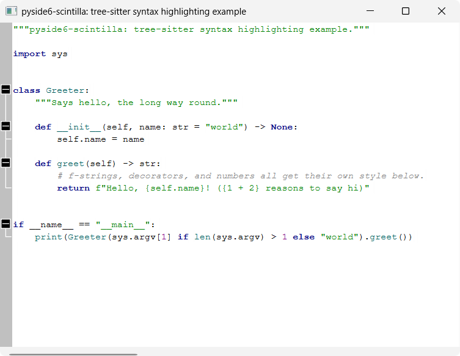

# tree-sitter syntax highlighting and folding

A minimal `QMainWindow` with a `ScintillaEdit` central widget, showing Python
syntax highlighting *and* code folding driven by
[tree-sitter](https://tree-sitter.github.io/tree-sitter/).
`pyside6-scintilla` doesn't wrap a lexer binding, so there's no
`SCI_SETLEXER` to flip on. Instead, `tree_sitter_highlighter.py` parses the
editor's text with a tree-sitter `Language` (here, `tree-sitter-python`) on
every edit and:

- runs a highlight `Query` over the resulting tree and applies the captured
  node ranges manually via `ScintillaEdit`'s raw `SCI_STYLE*` messages
  (`styleSetFore()`, `startStyling()`, `setStyling()`, ...);
- walks the tree's `block` nodes (the indented body of any compound
  statement) to compute each line's fold level and applies it via
  `setFoldLevel()` — the same message a real lexer would drive folding
  with, wired to a standard "boxes" fold margin.

Both re-run on every edit via the editor's document's `modified` signal.

`tree_sitter_highlighter.py` has no dependencies beyond `pyside6-scintilla`,
`tree-sitter` and a tree-sitter language package — copy it straight into
your own project, same as [`bscintillaedit.py`](../examples/bscintillaedit.md).
`main.py` itself stays a thin PySide6 app shell, and owns the hand-written
highlight query (`HIGHLIGHTS_QUERY`) for Python, since the query is
grammar-specific and not part of the reusable highlighter.

`TreeSitterHighlighter.rehighlight()` re-parses and re-queries the whole
buffer on every edit, which is fine at example/small-file scale but won't
scale to large files — a production version would use tree-sitter's
incremental parsing (`Parser.parse(..., old_tree=...)`) and restyle/refold
only the changed range instead.

> [!NOTE]
> `HIGHLIGHTS_QUERY` is a small, hand-written query covering keywords,
> strings, numbers, comments, function/class names, and calls — not the
> full capture set you'd get from a real grammar's `highlights.scm` (e.g.
> from [nvim-treesitter](https://github.com/nvim-treesitter/nvim-treesitter)).
> Anything not captured falls back to the default style.

> [!NOTE]
> Folding is keyed off the Python grammar's `block` node alone (any
> indented compound-statement body) — good enough for
> `if`/`for`/`while`/`def`/`class`/etc., but a grammar with other foldable
> constructs (e.g. multi-line collections, import groups) would need more
> node types in `fold_levels()`.

> [!NOTE]
> A `TreeSitterHighlighter` instance is bound 1:1 to one `ScintillaEdit` at
> construction — it can't highlight multiple widgets by itself. To
> highlight several editors, create one instance per widget:
>
> ```python
> highlighter_a = TreeSitterHighlighter(editor_a, language, HIGHLIGHTS_QUERY)
> highlighter_b = TreeSitterHighlighter(editor_b, language, HIGHLIGHTS_QUERY)
> ```
>
> This also matches how Qt's own `QSyntaxHighlighter` attaches to one
> `QTextDocument` at a time. Note that styling is per-view, not
> per-document — even if two editors share an underlying document via
> `setDocPointer()`, each still needs its own highlighter.
>
> `TreeSitterHighlighter` is a `QObject`. Pass a `parent` (e.g. the window
> that owns the editor, as `main.py` does) to tie its lifetime to that
> object instead of keeping an explicit reference around:
>
> ```python
> TreeSitterHighlighter(editor, language, HIGHLIGHTS_QUERY, parent=window)
> ```

> [!NOTE]
> `ScintillaEdit.modified`'s `Scintilla::Position`/`Scintilla::FoldLevel`-typed
> parameters can't be marshalled to a Python slot — `TreeSitterHighlighter`
> connects to `editor.get_doc().modified` instead, which carries the same
> notification with plain-int parameters (see
> [`bscintillaedit.py`](../examples/bscintillaedit.md) for the same workaround).

## Running

From the repo root, after `uv sync`:

```bash
uv run python examples/highlighting/tree_sitter_highlighting/main.py
```

`tree-sitter` and `tree-sitter-python` are dev-only dependencies of this
repo, used solely for this example — they are not dependencies of the
`pyside6-scintilla` package itself.

## Source

[`examples/highlighting/tree_sitter_highlighting/`](https://github.com/borco/pyside6-scintilla/tree/master/examples/highlighting/tree_sitter_highlighting)

## Screenshots


