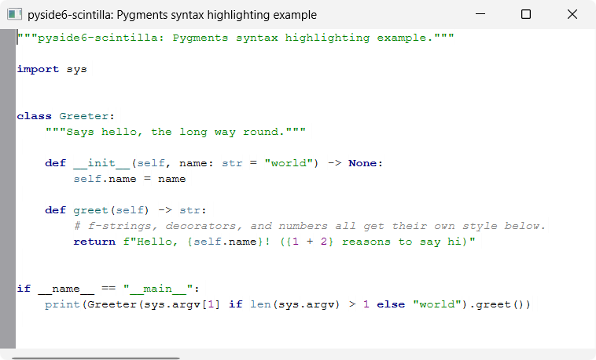

# pygments_highlighting

A minimal `QMainWindow` with a `ScintillaEdit` central widget, showing Python
syntax highlighting driven by [Pygments](https://pygments.org/) — `pyside6-
scintilla` doesn't wrap a lexer binding, so there's no `SCI_SETLEXER` to flip
on. Instead, [`pygments_highlighter.py`](pygments_highlighter.py) tokenizes
the editor's text with Pygments' lexer/token API and applies the resulting
styles manually via `ScintillaEdit`'s raw `SCI_STYLE*` messages
(`styleSetFore()`, `startStyling()`, `setStyling()`, ...), re-running on
every edit via the editor's `modified` signal.

`pygments_highlighter.py` has no dependencies beyond `pyside6-scintilla` and
`pygments` — copy it straight into your own project, same as
[`bscintillaedit.py`](../../bscintillaedit/). `main.py` itself stays a thin
PySide6 app shell.

## Limitations

`PygmentsHighlighter.rehighlight()` re-tokenizes the *whole* buffer on every
edit. That's fine at example/small-file scale, but won't scale to large
files — a production version would restyle only the changed region (using
the `modified` signal's position/length) and reuse the lexer's stateful
tokenizing where the lexer supports it.

## Running

From the repo root, after `uv sync`:

```bash
uv run python examples/highlighting/pygments_highlighting/main.py
```

Pygments is a dev-only dependency of this repo (`pygments` in the `dev`
dependency group in `pyproject.toml`) used solely for this example — it is
not a dependency of the `pyside6-scintilla` package itself.

## Screenshots


